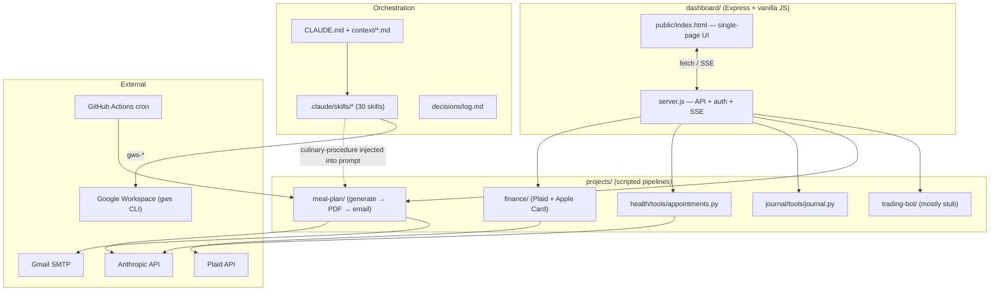
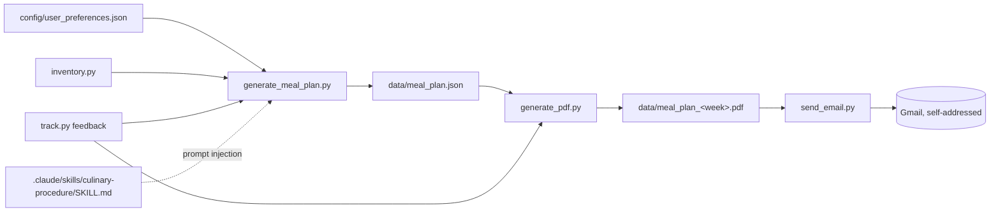
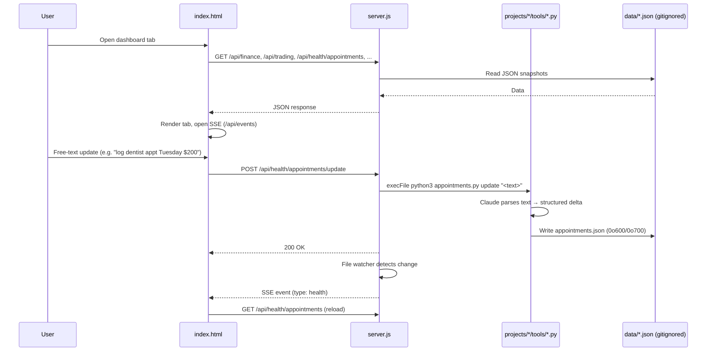
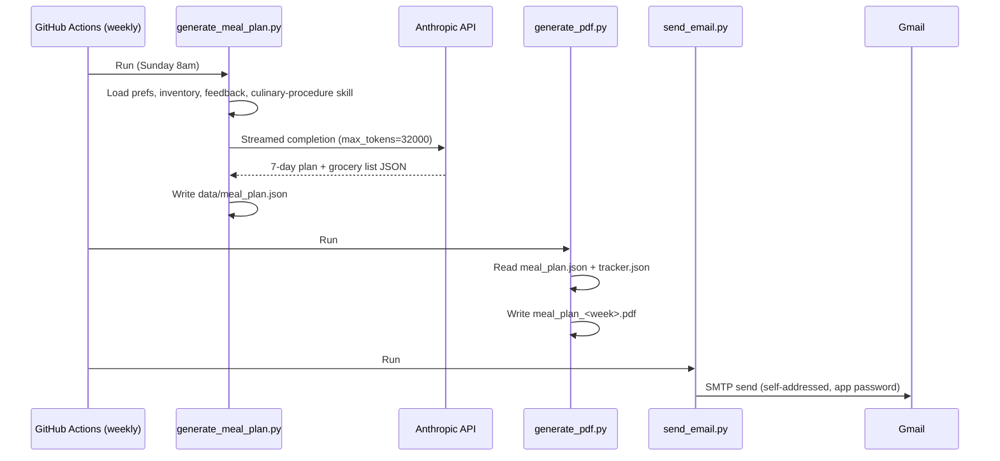

# Codebase Map

> Auto-generated by Cartographer. Last mapped: 2026-07-29T13:48:02Z

## System Overview

Compass is Adreyn's personal "AIOS" (AI operating system) — a Claude Code-orchestrated second brain that tracks finance, health, meal planning, journaling, and a day-trading bot, surfaced through a single local Express dashboard. Code is versioned; personal data lives in gitignored `data/` directories next to the scripts that produce it.



## Directory Structure

```
Compass/
├── dashboard/              # The one running app — Express API + static UI
│   ├── server.js
│   └── public/index.html
├── projects/               # Scripted automation pipelines, one per life domain
│   ├── finance/            # Plaid + Apple Card import/sync/summary
│   ├── health/tools/       # Appointment tracking (PHI, permission-hardened)
│   ├── journal/tools/      # Append-only personal journal backend
│   ├── meal-plan/          # generate → PDF → email pipeline (cron'd)
│   └── trading-bot/        # "Anchor project" — mostly stub
├── context/                # me.md, work.md, current-priorities.md, goals.md, team.md
├── decisions/log.md        # Append-only decision log
├── references/             # finance/, meal-plans/, research/, sops/, workouts/, examples/
├── archives/               # Superseded material (never deleted, moved here)
├── templates/              # session-summary.md
├── .claude/skills/         # 30 skills (11 hand-authored + 19 gws-* symlinked)
├── .agents/skills/         # Real files for installed skills; symlink target
├── .github/workflows/      # weekly_meal_plan.yml cron
├── skills-lock.json        # Provenance/hash ledger for installed skills
├── CLAUDE.md                # System prompt / entry point
└── package.json             # npm scripts: dashboard, tunnel, apple:import, plaid:*, finance:summary, meal:generate, trade:log
```

## Module Guide

### Dashboard (`dashboard/`)

**Purpose**: Single Express server + single static HTML file that is the entire user-facing app — auth gate, all data APIs, SSE live updates, and a `claude` CLI-backed chat.
**Entry point**: `dashboard/server.js` (port 4000, run via `npm run dashboard`, exposed externally via ngrok tunnel)

| File | Purpose | Tokens |
|------|---------|--------|
| `dashboard/server.js` | Express API: auth, WebAuthn, finance/trading/meal-plan/inventory/journal/health routes, SSE, chat | 10,934 |
| `dashboard/public/index.html` | Single-page vanilla-JS UI: Finance, Trading, Meal Plan, Recipes, Shopping List, Inventory, Health tabs + chat | 27,630 |

**Exports/Routes**: Auth (`/login`, session touch/lock), WebAuthn privacy gate, `/api/events` SSE, finance (`/api/finance`, `/api/sync`, `/api/apple-card`, `/api/income`), goals, trading (`/api/trading`, `/api/trade`), meal-plan/inventory/grocery-list routes, journal, health appointments, chat.

**Dependencies**: `express`, `@simplewebauthn/server`, `dotenv`, `plaid`; shells out to `python3` tools under `projects/*/tools/`, `node projects/finance/plaid/sync.js`, `projects/trading-bot/performance/stats.js`, and the `claude` CLI itself for chat.

**Dependents**: Nothing — it's the top of the stack, the thing the user actually opens.

**Patterns**: Cookie-based shared-secret auth with sliding session; file-watch → debounce → SSE fan-out for real-time UI refresh without polling; Python subprocess helpers reused identically by both direct REST routes and the chat endpoint so chat can't gain broader write access than the buttons already have; markdown-as-database parsing for `context/goals.md` and the income log.

**Gotchas**:
- **Security gap**: `/api/health/appointments/complete` and `/api/health/appointments/remove` in `server.js` write `appointments.json` via plain `writeFileSync` (default permissions), bypassing the `0o600`/`0o700` hardening that commit `8497f3f` added to `appointments.py`. Only the `/update` route (which shells out to the Python tool) gets the restrictive mode — the other two routes can silently re-widen permissions on real medical/financial (cost) data.
- WebAuthn/Face ID is a **glance shield only** — it blurs numbers client-side; `/api/finance` and `/api/trading` return raw data regardless of lock state.
- `PATH` is manually rebuilt at the top of `server.js` to force system `python3` (3.9, has the needed pip packages) ahead of Homebrew's bare `python3` (3.14) — launchd silently fails the job if `PATH` is set directly in the plist instead.
- `app.set('trust proxy', true)` is required for WebAuthn to see `https` through the ngrok hop; misconfiguring this silently breaks Face ID.
- `DEBT_BASELINE` (7010.43) and `PAYOFF_TARGET` (2026-12-31) are hardcoded in `server.js` **and separately** hardcoded in `projects/finance/summary.js` **and** documented in `references/finance/debt-tracker.md` — three independent sources of the same numbers with no shared source of truth.
- Chat endpoint's Python "action" side effects (inventory/feedback/grocery updates) are triggered by pattern-matching the raw user message text, not by anything the `claude` CLI subprocess actually decides.

### Finance (`projects/finance/`)

**Purpose**: Two parallel, partially-disconnected debt/account tracking mechanisms — live Plaid sync for bank accounts, manual CSV import for Apple Card.
**Entry point**: `npm run plaid:link` (once per institution) → `npm run plaid:sync` → `npm run finance:summary`; `npm run apple:import <csv> <balance>` separately.

| File | Purpose | Tokens |
|------|---------|--------|
| `apple-card/import.js` | Parses exported Apple Card CSV → `data/apple_card.json` | 699 |
| `plaid/link.js` | One-time local OAuth flow, writes `data/access_tokens.json` | 1,124 |
| `plaid/sync.js` | Pulls balances + 30-day transactions → `data/snapshot.json` | 1,411 |
| `summary.js` | Reads `snapshot.json`, renders cash/debt/spending report | 1,434 |

**Data flow**: `link.js` → `access_tokens.json` → `sync.js` → `snapshot.json` → `summary.js` (Plaid side, live). `import.js` → `apple_card.json` is a **dead end** — nothing reads it.

**Gotchas**:
- `summary.js` does not read `apple_card.json` at all; its Apple Card debt figure is a hardcoded literal (`manualBalance: 2981.19`) that has to be hand-updated in source after every `import.js` run.
- Real dollar figures (`DEBT_BASELINE = 7010.43`, Apple Card `2981.19`) are hardcoded directly in committed source in `summary.js` — these numbers live in git history, not just gitignored `data/`.
- `access_tokens.json` holds plaintext Plaid access tokens with no permission hardening (contrast with `appointments.py` below).
- `sync.js` hardcodes a 30-day window and 100-transaction cap per institution with no pagination — could silently truncate an active account.

### Health (`projects/health/tools/appointments.py`)

**Purpose**: Freeform-text-in → structured appointment record out (Claude-parsed), append-only to `data/appointments.json`.
**Key behavior**: `parse_update()` (Claude call, null-fallback if text isn't an appointment), `update_from_text()`, CLI `list`/`update`.
**Gotchas**: Contains real PHI (appointment cost, financing terms). The **only** data file in the repo with explicit `0o600` file / `0o700` dir permission hardening in code (added in commit `8497f3f`) — but see the dashboard gotcha above: two `server.js` routes bypass this hardening.

### Journal (`projects/journal/tools/journal.py`)

**Purpose**: Append-only personal journal backend, stdlib-only (no LLM call, no `.env`). Entries are never edited once saved.
**Gotcha**: No permission hardening on `data/entries.json`, despite potentially sensitive content — inconsistent with `appointments.py`.

### Meal Plan (`projects/meal-plan/`)

**Purpose**: Automated weekly high-protein meal plan generation, cron'd via GitHub Actions (`.github/workflows/weekly_meal_plan.yml`), feeding a self-improving loop (feedback → next week's prompt).
**Entry point**: `npm run meal:generate` (`generate_meal_plan.py`); PDF + email are separate CLI steps chained by the GH Action, not by each other.

| File | Purpose | Tokens |
|------|---------|--------|
| `tools/generate_meal_plan.py` | Claude call → 7-day plan + grocery list JSON | 2,553 |
| `tools/inventory.py` | Fridge/pantry stock, delta-updated via Claude parse | 2,650 |
| `tools/grocery_list.py` | Separate general shopping list (food + household) | 1,364 |
| `tools/track.py` | Per-week cost/rating feedback, closes the loop back into generation | 1,821 |
| `tools/generate_pdf.py` | Renders `meal_plan.json` → styled PDF via reportlab | 3,110 |
| `tools/send_email.py` | Emails the PDF via Gmail SMTP app password | 1,285 |



**Gotchas**:
- `.claude/skills/culinary-procedure/SKILL.md` is read directly by `generate_meal_plan.py` and injected verbatim into the LLM prompt — editing that skill file changes generation behavior without touching any Python.
- `send_email.py` fails gracefully (prints local-save instructions) if `GMAIL_APP_PASSWORD` is unset — headless-safe for CI.
- `archives/meal-plan-google-setup.md` documents the original Sheets-based tracking approach, explicitly superseded because it silently no-op'd on the GH Actions runner (missing `credentials.json`) — `track.py`/`tracker.json` replaced it; only Gmail app-password delivery survived from that setup.

### Trading Bot (`projects/trading-bot/`) — the "anchor project," least mature module

**Purpose**: Per `CLAUDE.md`, this is meant to fund everything else. In practice it's mostly a stub.
**Status**: README lists all four modules (Journal, Research, Strategies, Performance) as "Backlog" despite journal/performance code existing. `research/` and `strategies/` are empty (`.gitkeep` only). `data/trades.json` is `[]`.

| File | Purpose | Tokens |
|------|---------|--------|
| `journal/log.js` | Working CLI (`npm run trade:log`) — computes P&L, appends to `trades.json` | 875 |
| `performance/stats.js` | `loadTrades`/`saveTrade`/`calcStats` — richer schema, never imported anywhere | 1,511 |

**Gotcha**: `performance/stats.js` is orphaned — no CLI entry point, no `package.json` script, not called by `log.js`. Its trade schema (adds `stop`, `actual_rr`, `grade`, `emotion`) doesn't match `log.js`'s simpler schema, so even if wired up, grade/emotion breakdowns would be empty for CLI-logged trades.

### Skills System (`.claude/skills/`, 30 skills)

**Purpose**: Reusable workflows Claude Code invokes by name. Two provenance tiers:
- **Installed/upstream** (19 `gws-*` + `audit`): physically live under `.agents/skills/`, symlinked into `.claude/skills/`, version-pinned in `skills-lock.json`. Maintained by the `skill-updates` skill (runs `npx skills update`, diffs, and waits for human accept/reject — never applies silently).
- **Hand-authored** (11): `finance-tracker`, `meal-planner`, `workout-planner`, `trade-journal`, `research-routine`, `culinary-procedure`, `personal-journal`, `repo-finder`, `skill-updates`, `audit`... live natively, not lock-tracked (except `audit`, which is both installed *and* meta).

**Google Workspace module** (20 files under the `gws-*` umbrella): wraps the `gws` CLI for Gmail/Calendar/Drive/Sheets/Docs/Slides/Tasks. `gws-shared` is the load-bearing prerequisite (auth, CLI grammar, security rules: confirm before writes, prefer `--dry-run`, never print secrets). Every mutating helper carries an explicit "confirm with the user before executing" caution block; read-only helpers explicitly state they never modify anything.

**Personal/life skills** each pair with a `projects/` automation but only loosely:
- `culinary-procedure` is the one skill genuinely wired into code — read and prompt-injected by `generate_meal_plan.py` on every run.
- `meal-planner` (chat-driven, saves to `references/meal-plans/`) and `projects/meal-plan/` (Python + cron pipeline) are parallel surfaces for the same domain, not calling into each other.
- `trade-journal` (chat, writes `projects/trading-bot/journal/YYYY-MM.md`) sits alongside `journal/log.js` (JS CLI, writes `trades.json`) — same domain, different files, not integrated.
- `personal-journal` drives `projects/journal/tools/journal.py` directly (`python3 ... add "<text>" chat`) — the most directly-wired chat-to-script pairing in the repo, and the one skill explicitly told to promote only genuine recurring patterns into the persistent memory system (most entries stay raw).

**Gotcha**: `gws-gmail`'s helper table links to a `gws-gmail-watch` skill that doesn't exist among the installed folders — dangling reference from upstream, not yet installed locally.

## Data Flow

### Dashboard request/update cycle



### Meal-plan weekly cron



## Conventions

- **Data isolation**: every domain's `data/` directory is gitignored; only code and skill definitions are committed. `.env` holds all secrets (`ANTHROPIC_API_KEY`, `PLAID_CLIENT_ID/SECRET/ENV`, `GMAIL_APP_PASSWORD`, `DASHBOARD_USER/PASS`).
- **Freeform-text → Claude-parsed delta → merge → save** is the standard shape for `appointments.py`, `inventory.py`, `grocery_list.py`, `track.py` — the model proposes a delta, never a full rewrite.
- **Append-only logs**: `decisions/log.md`, `projects/journal/tools/journal.py`, `trade-journal` skill output — never edit past entries, only append.
- **Archive, don't delete**: superseded material moves to `archives/` (see `archives/meal-plan-google-setup.md`).
- **CLI-first automation**: every `projects/` script is runnable standalone via `npm run <script>` or `python3 <tool>.py`, independent of the dashboard — the dashboard just shells out to the same entry points a human would use.

## Gotchas (repo-wide)

1. **Health data permission gap**: `dashboard/server.js`'s `/api/health/appointments/complete` and `/remove` routes bypass the `0o600`/`0o700` hardening in `appointments.py` — worth a follow-up fix.
2. **Debt figures hardcoded in committed source**: `projects/finance/summary.js` has real dollar amounts in git history, duplicated (and driftable) across `server.js` and `references/finance/debt-tracker.md`.
3. **Plaid access tokens unhardened**: `access_tokens.json` is plaintext with no file-permission restriction, unlike the health tool's approach.
4. **Trading bot is a stub** despite being the designated anchor/funding project — `research/` and `strategies/` are empty, `performance/stats.js` is orphaned/unwired, and its schema doesn't match `journal/log.js`'s.
5. **Apple Card pipeline is disconnected**: `import.js` writes a file nothing reads; the actual balance used in reports is a manually-maintained literal.
6. **WebAuthn is a glance shield, not an authorization boundary** — raw finance/trading data is always returned by the API regardless of lock state.
7. **Skill/automation pairs are loosely coupled**: `meal-planner` vs. `projects/meal-plan/`, `trade-journal` vs. `projects/trading-bot/` are parallel, non-integrated surfaces for the same domain (only `culinary-procedure` and `personal-journal` are genuinely wired into their corresponding scripts).
8. **`gws-gmail-watch` dangling reference**: linked from `gws-gmail`'s SKILL.md but not installed locally.

## Navigation Guide

**To add a new dashboard API route**: `dashboard/server.js` (add route handler) + `dashboard/public/index.html` (add `fetch` call and render logic) + optionally register the SSE `type` in the frontend's `_reloadMap`.

**To change how finance data is computed/displayed**: `projects/finance/summary.js` (CLI report logic) and/or `dashboard/server.js`'s `/api/finance` route (dashboard logic is separate from the CLI script — check both).

**To fix the Apple Card / summary.js disconnect**: wire `projects/finance/summary.js` to read `data/apple_card.json` instead of the hardcoded `manualBalance` literal.

**To modify meal-plan generation logic**: `projects/meal-plan/tools/generate_meal_plan.py` for structure/prompting, or `.claude/skills/culinary-procedure/SKILL.md` for food-safety/prep rules (it's injected into the prompt — don't duplicate logic in the Python file).

**To add/modify a Google Workspace skill**: skills are installed via the `skills` CLI from `googleworkspace/cli`, not hand-edited — use the `skill-updates` skill to check for upstream changes, or `repo-finder` to evaluate a different tool.

**To add a new personal/life skill**: create `.claude/skills/<name>/SKILL.md`, follow the existing convention (check-in → do the work → save to `references/<domain>/` or `projects/<domain>/` → end with one concrete next action).

**To work on the trading bot**: `projects/trading-bot/journal/log.js` and `performance/stats.js` are the only real code; `research/` and `strategies/` are empty and need to be built from scratch. Consider reconciling the two trade schemas before building further.
