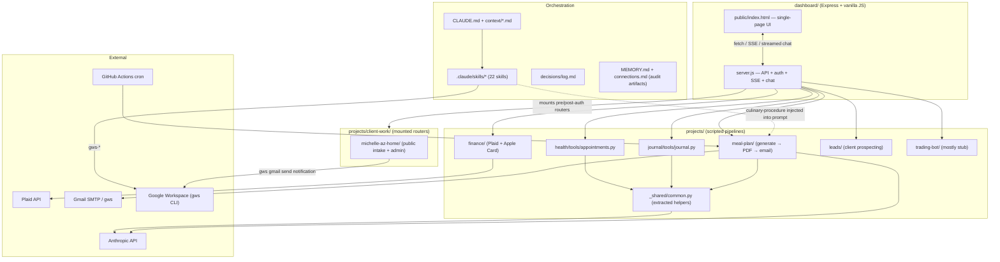
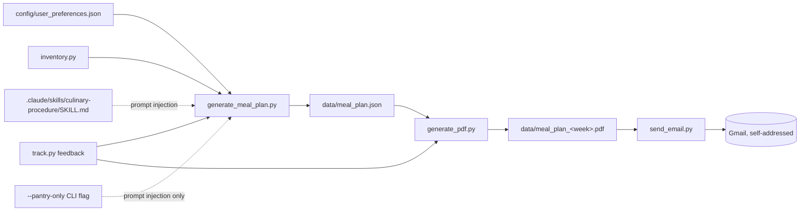
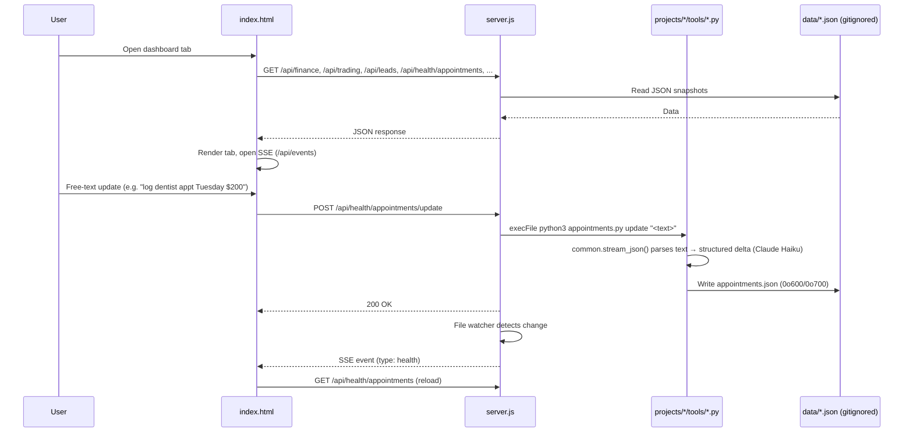
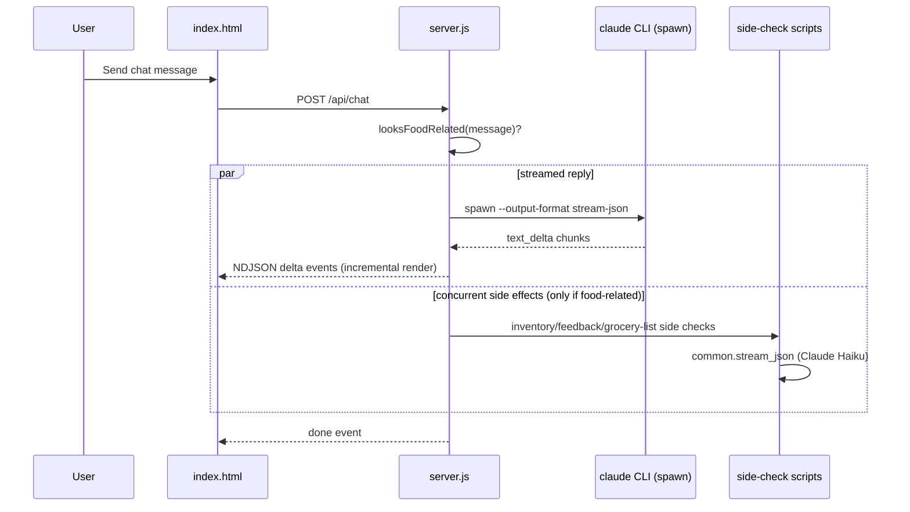
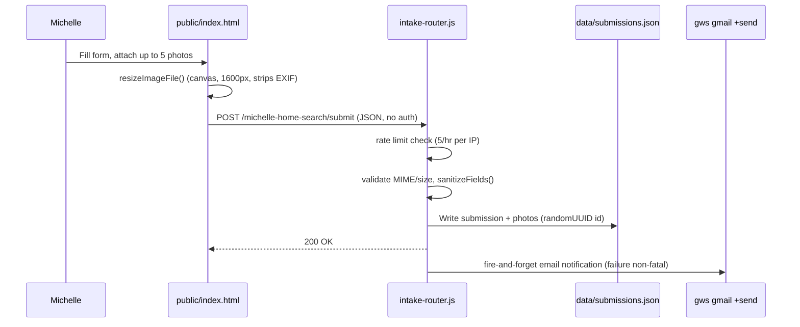
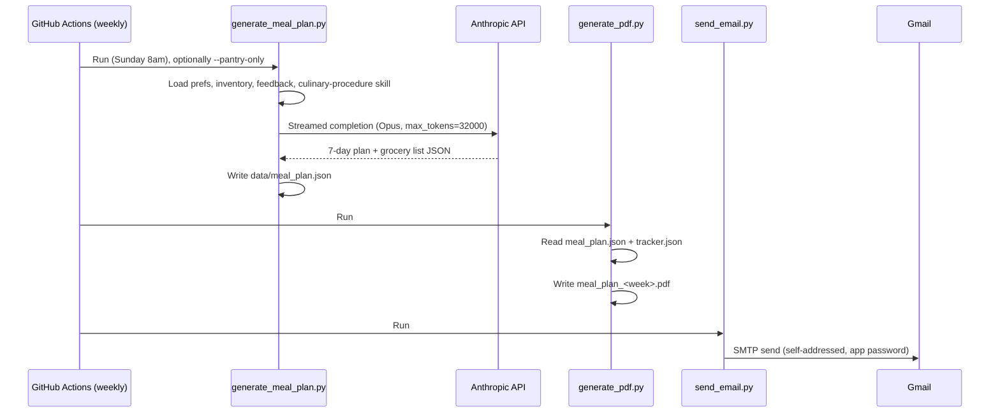

# Codebase Map

> Auto-generated by Cartographer. Last mapped: 2026-07-31T16:33:41Z

## System Overview

Compass is Adreyn's personal "AIOS" (AI operating system) — a Claude Code-orchestrated second brain that tracks finance, health, meal planning, journaling, freelance client work, and a day-trading bot, surfaced through a single local Express dashboard. Code is versioned; personal data lives in gitignored `data/` directories next to the scripts that produce it. As of this mapping, the repo also carries a same-day self-audit pass (`MEMORY.md`, `connections.md`, `audits/`, `references/plaid-api.md`, all still untracked) that raised its own audit score from 78 to 87/100.



## Directory Structure

```
Compass/
├── dashboard/              # The one running app — Express API + static UI
│   ├── server.js
│   └── public/index.html
├── projects/               # Scripted automation pipelines, one per life domain
│   ├── _shared/             # common.py — shared JSON/ID/Claude-call helpers (new)
│   ├── finance/             # Plaid + Apple Card import/sync/summary
│   ├── health/tools/        # Appointment tracking (PHI, permission-hardened)
│   ├── journal/tools/       # Append-only personal journal backend
│   ├── meal-plan/           # generate → PDF → email pipeline (cron'd), pantry-only mode
│   ├── leads/                # Des Moines food-industry client prospecting tracker (new)
│   ├── client-work/          # Per-client mini-apps mounted into the dashboard (new)
│   │   └── michelle-az-home/ # AZ home-search intake form + admin photo viewer
│   └── trading-bot/         # "Anchor project" label (stale) — mostly stub
├── context/                # me.md, work.md, current-priorities.md, goals.md, team.md
├── decisions/log.md        # Append-only decision log
├── references/             # finance/, plaid-api.md, meal-plans/, research/, sops/, workouts/, examples/
├── docs/superpowers/        # plans/ + specs/ for out-of-repo projects (e.g. Perspective AI site)
├── .superpowers/sdd/         # self-gitignored task-execution scratch space (briefs/reports/diffs)
├── archives/               # Superseded material (never deleted, moved here)
├── templates/              # session-summary.md
├── .claude/skills/         # 22 skills (11 hand-authored + 20 gws-* + audit + frontend-design)
├── .agents/skills/         # Real files for installed skills; symlink target
├── .github/workflows/      # weekly_meal_plan.yml cron
├── skills-lock.json        # Provenance/hash ledger for installed skills (22 entries)
├── .jscpd.json              # Duplicate-code detector config (new)
├── MEMORY.md                 # Hand-built persistent-memory doc (audit artifact, untracked)
├── connections.md            # External-connections registry (audit artifact, untracked)
├── audits/                   # Audit skill reports (untracked)
├── CLAUDE.md                # System prompt / entry point
└── package.json             # npm scripts: dashboard, tunnel, apple:import, plaid:*, finance:summary, meal:generate, trade:log, dup-check
```

## Module Guide

### Dashboard (`dashboard/`)

**Purpose**: Single Express server + single static HTML file that is the entire user-facing app — auth gate, all data APIs, SSE live updates, a streaming `claude` CLI-backed chat, and now the mount point for per-client mini-apps.
**Entry point**: `dashboard/server.js` (port 4000, run via `npm run dashboard`, exposed externally via ngrok tunnel)

| File | Purpose | Tokens (at last full scan) |
|------|---------|--------|
| `dashboard/server.js` | Express API: auth, WebAuthn, finance/trading/meal-plan/inventory/journal/health/leads routes, mounts Michelle's routers, SSE, streaming chat | 12,662 |
| `dashboard/public/index.html` | Single-page vanilla-JS UI: Finance, Trading, Meal Plan, Recipes, Shopping List, Inventory, Health, **Leads** tabs + streaming chat | 31,805 |

**Exports/Routes**: Auth (`/login`, session touch/lock), WebAuthn privacy gate, `/api/events` SSE, finance (`/api/finance`, `/api/sync`, `/api/apple-card`, `/api/income`), goals, trading (`/api/trading`, `/api/trade`), meal-plan/inventory/grocery-list routes, journal, health appointments, **`/api/leads` + `/api/leads/add|update|remove`**, `/api/chat` (streaming NDJSON) + `/api/chat/reset`; mounts `michelleIntakeRouter` (pre-auth, public) and `michelleAdminRouter` (post-auth) from `projects/client-work/michelle-az-home/server/intake-router.js`.

**Dependencies**: `express`, `@simplewebauthn/server`, `dotenv`, `plaid`; shells out to `python3` tools under `projects/*/tools/`, `node projects/finance/plaid/sync.js`, `projects/trading-bot/performance/stats.js`, and the `claude` CLI (now via `spawn`/streaming, not `execFile`).

**Dependents**: Nothing — it's the top of the stack, the thing the user actually opens.

**Patterns**: Cookie-based shared-secret auth with sliding session; file-watch → debounce → SSE fan-out for real-time UI refresh without polling; Python subprocess helpers reused identically by both direct REST routes and the chat endpoint; markdown-as-database parsing for `context/goals.md` and the income log; per-domain in-memory load/save singletons.

**Gotchas**:
- **Security gap CLOSED**: the previously-flagged asymmetry where `/api/health/appointments/complete` and `/remove` bypassed the 0o600/0o700 permission hardening that `/update` got is fixed — a `saveHealthAppointments()` helper (added alongside the Michelle project, commit `0dae38b`) now applies the same chmod hardening on all three routes.
- WebAuthn/Face ID is **still a glance shield only** (code comment confirms it explicitly) — it blurs numbers client-side; `/api/finance` and `/api/trading` still return raw data regardless of lock state.
- `DEBT_BASELINE` (7010.43) and `PAYOFF_TARGET` (2026-12-31) are **still hardcoded** in `server.js`, unchanged from last mapping.
- **Chat sped up** (commit `18c4a66`): (1) `looksFoodRelated()` keyword-gates the inventory/feedback/grocery-list side-check subprocesses so they only run when the message plausibly mentions food, instead of on every message; (2) those side effects now run **concurrently** with the main reply instead of serially after it; (3) the reply itself streams as NDJSON `text_delta` chunks via `spawn` + `claude ... --output-format stream-json --include-partial-messages`, instead of blocking on the full response; (4) the Python side-check scripts' shared default model dropped from `claude-opus-4-8` to `claude-haiku-4-5` (via `common.stream_json`).
- Michelle's public router is mounted **before** the dashboard's auth-gate middleware (no password needed for the intake link); `michelleAdminRouter` (serves uploaded photos) is mounted **after** the gate — same file, two mount points, deliberately split.
- `express.json({ limit: '25mb' })` was raised app-wide specifically for Michelle's base64 photo uploads — an app-wide side effect of a single-feature need.
- Chat endpoint's Python "action" side effects (inventory/feedback/grocery updates) are still triggered by pattern-matching the raw user message text, not by anything the `claude` CLI subprocess actually decides.
- New Leads tab renders `contact.website` as a raw `<a href="//...">` link with only `escapeHtml` applied — no protocol/domain validation (low risk, single-user app, but worth knowing before exposing further).
- `chatSessionId`/`chatBusy`/`webauthnChallenge` are in-memory module-level singletons — fine for single-user, but concurrent chat/registration attempts collide and state is lost on server restart.

### Client Work (`projects/client-work/`) — new module

**Purpose**: Per-client mini-apps, mounted as Express routers directly into `dashboard/server.js` rather than run as standalone services. Currently one client: `michelle-az-home/`.

**`michelle-az-home/`** — Adreyn's first client-facing deliverable: a custom intake questionnaire for an Arizona home search (target Jan–Mar 2027, ZIPs 85266/85254 pre-filled). Phase 2 (listing search/curation) hasn't started; no submissions exist yet.

| File | Purpose |
|------|---------|
| `README.md` | Project brief — portfolio piece for turning "AI-for-others" into paid work |
| `public/index.html` | The intake form: constraints box, budget/type/must-haves, photo-reaction galleries curated for the target ZIPs, up to 5 uploaded reference photos |
| `server/intake-router.js` | Two Express routers: public (`GET /`, `POST /submit`) and admin (`GET /uploads/...`) |

**Auth/rate-limit/ID design** (all defense-in-depth for a link texted to a real person, no login):
- No auth on `/submit` by design; admin router (uploaded photo viewing) sits behind the dashboard's existing auth gate.
- Per-IP in-memory rate limit: 5 submissions/hour, resets on server restart — "proportionate to a single-node personal tool."
- IDs are `randomUUID()`, not sequential — the ID also names the upload directory served back post-auth, so it must be unguessable.
- Photos: base64 payload regex-matched against a MIME allowlist (jpeg/png/webp) that determines the file extension server-side (client-claimed type/filename never trusted); max 5 photos, 3MB decoded cap each; invalid/oversized photos silently dropped.
- Every string field truncated to 5000 chars, every array to 50 entries, on the way into storage.
- Client-side `resizeImageFile()` draws uploads onto a canvas at max 1600px/quality 0.8 before sending — shrinks payload and, as a side effect, strips EXIF/GPS metadata.
- Fire-and-forget `gws gmail +send` notification to `adreynf@perspectiveautomation.com` on submit; failure is logged but never fails the response to the client.

**Gotcha**: `savePhotos()` silently drops any photo that fails validation with no visible signal to Michelle or Adreyn that it happened — a slightly-oversized or unsupported photo just vanishes from the submission.

### Leads (`projects/leads/`) — new module

**Purpose**: Top-of-funnel prospecting tracker for small food-industry businesses (restaurants, butchers, food retail, bakeries, food trucks) in the Des Moines metro showing evidence of struggling (bad reviews, broken/no website, dead social) — feeds the freelance/automation anchor project.

**Structure**: `data/leads.json` (gitignored) — flat array, `status` (`found → contacted → pitched → won/lost`) is the only enum-like field driving dashboard grouping; everything else free text. Sourcing is manual/agent-driven web research on request, deliberately **not** a recurring scraper (explicit ToS-gray-area concern against sites like Yelp/Google). Research write-ups land in `references/research/<topic>.md` first, then get seeded into `leads.json` as the live operational copy.

**Plugs into dashboard via**: `LEADS_FILE` constant + `loadLeads()`/`saveLeads()` in `server.js`, four `/api/leads*` routes, an SSE watcher, and a "Leads" main-tab in `index.html` with a pipeline board (`LEAD_PIPELINE`/`LEAD_NEXT_STATUS`) and an add-lead form.

**Cross-reference**: `references/research/des-moines-food-business-leads.md` (the point-in-time research doc) is explicitly name-banned from ever appearing on the public Perspective AI Consulting site — see that module below.

### Finance (`projects/finance/`)

**Purpose**: Two parallel, partially-disconnected debt/account tracking mechanisms — live Plaid sync for bank accounts, manual CSV import for Apple Card.
**Entry point**: `npm run plaid:link` (once per institution) → `npm run plaid:sync` → `npm run finance:summary`; `npm run apple:import <csv> <balance>` separately.
**Reference doc**: `references/plaid-api.md` (new) documents the actual auth flow and flags that `sync.js` uses the legacy `/transactions/get` (fixed 30-day window, 100-result cap, no pagination) instead of the recommended cursor-based `/transactions/sync` — can silently drop transactions that changed state between syncs. No re-auth/"Link update mode" flow exists yet either.

| File | Purpose | Tokens |
|------|---------|--------|
| `apple-card/import.js` | Parses exported Apple Card CSV → `data/apple_card.json` | 699 |
| `plaid/link.js` | One-time local OAuth flow, writes `data/access_tokens.json` | 1,124 |
| `plaid/sync.js` | Pulls balances + 30-day transactions → `data/snapshot.json` | 1,411 |
| `summary.js` | Reads `snapshot.json`, renders cash/debt/spending report | 1,434 |

**Data flow**: `link.js` → `access_tokens.json` → `sync.js` → `snapshot.json` → `summary.js` (Plaid side, live). `import.js` → `apple_card.json` is a **dead end** — nothing reads it.

**Gotchas**:
- `summary.js` does not read `apple_card.json` at all; its Apple Card debt figure is a hardcoded literal (`manualBalance: 2981.19`).
- Real dollar figures (`DEBT_BASELINE = 7010.43`, Apple Card `2981.19`) are hardcoded directly in committed source in `summary.js`.
- `access_tokens.json` holds plaintext Plaid access tokens with no permission hardening (contrast with `appointments.py`).
- `sync.js` hardcodes a 30-day window and 100-transaction cap per institution with no pagination — see `references/plaid-api.md` for the recommended fix (cursor-based `/transactions/sync`).

### Shared Helpers (`projects/_shared/common.py`) — new module

**Purpose**: Extracted shared library for the health/journal/meal-plan Python tools — JSON load/save, ID generation, and the "stream a prompt to Claude Haiku, parse strict JSON, retry once" pattern. Driven by `jscpd` (new dev dependency, `.jscpd.json` config, `npm run dup-check`) flagging near-identical load/save/id-gen/stream-JSON logic duplicated across five tool files.

**Exports**: `load_json(path, default=None)`, `save_json(path, data, mode=None)` (restrictive-permission opt-in via `os.open` + `os.fdopen`, created atomically with the right mode rather than chmod'd after), `next_id(items, prefix)`, `strip_fences(raw)`, `stream_json(prompt, system, max_tokens=1024, retry=False)` (lazy `anthropic` import, `claude-haiku-4-5`, one retry on `JSONDecodeError`).

**Consumers**: `appointments.py`, `journal.py`, `grocery_list.py`, `inventory.py`, `track.py` (via `sys.path.insert(0, .../projects/_shared)`).

**Not a consumer**: `generate_meal_plan.py` — it makes its own direct Anthropic call (Opus, not Haiku, its own retry/backoff loop) and only imports sibling modules `track`/`inventory`, which themselves use `common`. So `common.py` isn't a fully universal layer; meal-plan generation is a fourth, parallel Claude-calling code path.

**Gotcha**: `mode` is opt-in per caller, not enforced centrally — see permission-hardening gotcha below.

### Health (`projects/health/tools/appointments.py`)

**Purpose**: Freeform-text-in → structured appointment record out (Claude-parsed), append-only to `data/appointments.json`.
**Key behavior**: `parse_update()` (Claude call via `common`, null-fallback if text isn't an appointment), `update_from_text()`, CLI `list`/`update`.
**Gotcha**: Contains real PHI (appointment cost, financing terms). The **only** one of the five `common`-consumer tools that opts into `common.save_json(..., mode=0o600)` + `DATA_DIR.mkdir(mode=0o700)` — added in commit `180f7f7` before the shared-helper extraction, preserved through it. `journal.py` (arguably equally sensitive) and the meal-plan tools do **not** opt in — see repo-wide gotcha below.

### Journal (`projects/journal/tools/journal.py`)

**Purpose**: Append-only personal journal backend, no LLM call, no `.env` load — just timestamps and appends raw text via `common`.
**Gotcha**: No permission hardening on `data/entries.json` (`common.save_json` called without `mode=`), despite `references/sops/skills-guide.md` explicitly calling this "the most private data in the repo" — inconsistent with `appointments.py`, and a gap that survived the `common.py` extraction.

### Meal Plan (`projects/meal-plan/`)

**Purpose**: Automated weekly high-protein meal plan generation, cron'd via GitHub Actions, feeding a self-improving loop (feedback → next week's prompt). Now also supports an on-demand **pantry-only mode**.
**Entry point**: `npm run meal:generate` (`generate_meal_plan.py`, optional `-- --pantry-only`); PDF + email are separate CLI steps chained by the GH Action.

| File | Purpose | Tokens |
|------|---------|--------|
| `tools/generate_meal_plan.py` | Claude call (Opus, own retry loop) → 7-day plan + grocery list JSON; now takes `pantry_only: bool` | 2,765 |
| `tools/inventory.py` | Fridge/pantry stock, delta-updated via Claude parse (via `common`); untouched by pantry-only work | 2,335 |
| `tools/grocery_list.py` | Separate general shopping list (food + household), via `common` | 1,123 |
| `tools/track.py` | Per-week cost/rating feedback via `common`, closes the loop back into generation | 1,633 |
| `tools/generate_pdf.py` | Renders `meal_plan.json` → styled PDF via reportlab | 3,110 |
| `tools/send_email.py` | Emails the PDF via Gmail SMTP app password | 1,285 |



**Pantry-only mode** (commit `c4746c0`): a `PANTRY_ONLY_BLOCK` prompt-injection template instructs the model that every recipe ingredient must already be in inventory and the grocery list must come back empty; triggered by the CLI flag `--pantry-only`, which also bypasses the normal "already generated this week" guard so it can force a regen. Purely prompt-engineering — `inventory.py` itself wasn't touched, and there's no code-level enforcement that the model actually honored the constraint.

**Gotchas**:
- `.claude/skills/culinary-procedure/SKILL.md` is read directly by `generate_meal_plan.py` and injected verbatim into the prompt — editing the skill file changes generation behavior without touching Python.
- `send_email.py` fails gracefully if `GMAIL_APP_PASSWORD` is unset — headless-safe for CI.
- No permission hardening on `inventory.py`/`grocery_list.py`/`track.py` data, despite `inventory.py` feeding directly into the meal-plan prompt.
- `archives/meal-plan-google-setup.md` documents the original (broken) Sheets-based tracking approach that `track.py` replaced.

### Trading Bot (`projects/trading-bot/`) — label inconsistency, see repo-wide gotchas

**Purpose**: Per `CLAUDE.md`'s `## Projects` list, still labeled "(anchor project)" — but see the repo-wide gotcha below: the Identity section of the same file now names the AI-automation/freelance work as the actual anchor project. In practice this module is mostly a stub.
**Status**: `research/` and `strategies/` are empty (`.gitkeep` only). `data/trades.json` is `[]`.

| File | Purpose | Tokens |
|------|---------|--------|
| `journal/log.js` | Working CLI (`npm run trade:log`) — computes P&L, appends to `trades.json` | 875 |
| `performance/stats.js` | `loadTrades`/`saveTrade`/`calcStats` — richer schema, imported by `dashboard/server.js`'s `/api/trading` route | 1,511 |

**Gotcha**: `performance/stats.js`'s trade schema (adds `stop`, `actual_rr`, `grade`, `emotion`) doesn't match `journal/log.js`'s simpler CLI schema, so grade/emotion breakdowns are empty for CLI-logged trades.

### Skills System (`.claude/skills/`, 22 skills)

**Purpose**: Reusable workflows Claude Code invokes by name. Two provenance tiers, now three installed/upstream skills instead of two:
- **Installed/upstream** (20 `gws-*` + `audit` + `frontend-design`, 22 total): physically live under `.agents/skills/`, symlinked into `.claude/skills/`, version-pinned in `skills-lock.json`. Maintained by the `skill-updates` skill (`npx skills update`, diff, human accept/reject).
  - `audit` (source `nateherkai/AIS-OS`): read-only "Four Cs" (Context/Connections/Capabilities/Cadence) structural score /100, ranked top-3-gaps output; optional side effect of saving to `audits/audit-{date}.md`.
  - `frontend-design` (source `anthropics/claude-code` official plugin): aesthetic-direction guidance against templated "AI-generated design" defaults; installed and applied to the dashboard UI (commit `803bfb8`), also invoked by the Perspective AI Consulting site plan.
- **Hand-authored** (11): `finance-tracker`, `meal-planner`, `workout-planner`, `trade-journal`, `research-routine`, `culinary-procedure`, `personal-journal`, `repo-finder`, `skill-updates`, plus cartographer's own docs.

**Google Workspace module** (20 `gws-*` files): wraps the `gws` CLI for Gmail/Calendar/Drive/Sheets/Docs/Slides/Tasks. `gws-shared` is the load-bearing prerequisite. Every mutating helper carries a "confirm before executing" caution block. Now also used by `michelle-az-home/server/intake-router.js` for fire-and-forget submission notifications.

**Personal/life skills** each pair with a `projects/` automation but only loosely — unchanged from last mapping except:
- `culinary-procedure` remains the one skill genuinely wired into code (`generate_meal_plan.py` prompt injection).
- `personal-journal` remains the most directly-wired chat-to-script pairing (`journal.py add "<text>" chat`).
- New: no dedicated hand-authored skill yet for `leads/` or `client-work/` — both are driven by ad hoc chat/agent work plus the existing `research-routine` skill for sourcing.

**Gotcha**: `gws-gmail`'s helper table still links to a `gws-gmail-watch` skill that doesn't exist among the installed folders — dangling reference from upstream.

### Audit Artifacts (new, untracked) — `MEMORY.md`, `connections.md`, `audits/`

These four files (`MEMORY.md`, `connections.md`, `audits/audit-2026-07-31.md`, `references/plaid-api.md`) are one coherent same-day audit-and-remediation pass, not separate additions:
- `audits/audit-2026-07-31.md` is the actual scored report — 78→87/100 after fixes, explicitly noting it was applied manually mid-session rather than via a fresh skill invocation.
- `MEMORY.md` (repo root — **not** the separate Claude Code cross-session auto-memory system) is a hand-structured Preferences/Standing-Status/Gotchas/Open-Questions doc that the `audit` skill's rubric checks for.
- `connections.md` is a new external-connections registry (Plaid, Schwab, Apple Card, Gmail/SMTP, `gws`, Anthropic API, ngrok) — `MEMORY.md`'s own "Open Questions" section notes none existed before this pass.
- `references/plaid-api.md` documents the real Plaid integration and flags the legacy-endpoint gotcha noted under Finance above.

### Perspective AI Consulting Site Planning (`docs/superpowers/`) — plans only, code lives elsewhere

**Purpose**: A 7-task implementation plan (`docs/superpowers/plans/2026-07-30-perspective-ai-consulting-site.md`) and design spec (`docs/superpowers/specs/2026-07-30-perspective-ai-consulting-site-design.md`) for a standalone single-page portfolio site under the "Perspective AI Consulting" brand — Adreyn's freelance AI-automation consulting identity.

**Confirmed out-of-repo**: the plan explicitly states the site's repo lives at `/Users/adreynfausett/Desktop/perspective-ai-consulting-site/`, a **separate git repo, not nested inside or committed to Compass** — plain HTML/CSS, no build step, deployed via GitHub Pages under `adreyn2-web`, custom domain `perspectiveautomation.com`.

**Guard rail worth knowing about**: both docs enforce that no real business name from `references/research/des-moines-food-business-leads.md` / `projects/leads/data/leads.json` may appear anywhere on the public site — the plan's Task 3 includes a verification script that greps for and fails on a banned-names list, since those are prospective clients whose flaws are catalogued there.

**Ephemeral scratch space**: `.superpowers/sdd/2026-07-30-perspective-ai-consulting-site/` holds task briefs/reports/diffs from executing this plan via the `subagent-driven-development` skill. It's self-gitignored (`.superpowers/sdd/.gitignore`) and not meant to be read in depth or committed — pure working scratch, safe to ignore when navigating the repo.

## Data Flow

### Dashboard request/update cycle



### Streaming chat cycle (new)



### Michelle intake submission (new)



### Meal-plan weekly cron



## Conventions

- **Data isolation**: every domain's `data/` directory is gitignored (including `projects/leads/data/` and `projects/client-work/*/data/` now); only code and skill definitions are committed. `.env` holds all secrets.
- **Freeform-text → Claude-parsed delta → merge → save** is the standard shape for `appointments.py`, `inventory.py`, `grocery_list.py`, `track.py` — the model proposes a delta, never a full rewrite. Formalized as `common.stream_json()` for four of these five tools.
- **Append-only logs**: `decisions/log.md`, `projects/journal/tools/journal.py`, `trade-journal` skill output — never edit past entries, only append.
- **Archive, don't delete**: superseded material moves to `archives/`.
- **CLI-first automation**: every `projects/` script is runnable standalone via `npm run <script>` or `python3 <tool>.py`, independent of the dashboard.
- **Client mini-apps as mounted routers, not separate services**: `michelle-az-home/server/intake-router.js` exports Express routers mounted directly into `dashboard/server.js` at different points relative to the auth gate, rather than running as its own process/port.
- **Duplicate-code detection**: `npm run dup-check` (`jscpd`) now scans `projects` and `dashboard` for JS/Python duplication — the mechanism that produced `projects/_shared/common.py`.

## Gotchas (repo-wide)

1. **`CLAUDE.md` anchor-project label is self-contradictory**: the Identity section (and `context/work.md`) now correctly name the AI-automation/freelance work as the current anchor project, but the `## Projects` list further down the same file still tags `projects/trading-bot/` as "(anchor project)" — a live, uncorrected inconsistency from commit `0802196`'s partial rewrite.
2. **Permission hardening is inconsistent across `common`-consumer tools**: only `appointments.py` opts into `common.save_json(..., mode=0o600)` — `journal.py` (explicitly called "the most private data in the repo" in `references/sops/skills-guide.md`), `grocery_list.py`, `inventory.py`, and `track.py` don't, despite the shared helper making it a one-line opt-in.
3. **`.claude/claude-security-guidance.md` doesn't mention health or journal data** as sensitive, only finance — an asymmetry given `appointments.json` got dedicated code-level hardening but no corresponding doc line.
4. **Debt figures hardcoded in committed source**: `projects/finance/summary.js` has real dollar amounts in git history, duplicated across `server.js` and `references/finance/debt-tracker.md`.
5. **Plaid access tokens unhardened**: `access_tokens.json` is plaintext with no file-permission restriction; `sync.js` also uses the legacy non-paginated `/transactions/get` endpoint (see `references/plaid-api.md`).
6. **Trading bot is a stub** despite its stale "(anchor project)" label — `research/` and `strategies/` are empty, and its schema doesn't match `journal/log.js`'s simpler CLI schema.
7. **Apple Card pipeline is disconnected**: `import.js` writes a file nothing reads; the actual balance used in reports is a manually-maintained literal.
8. **WebAuthn is a glance shield, not an authorization boundary** — raw finance/trading data is always returned by the API regardless of lock state.
9. **Skill/automation pairs are loosely coupled**: `meal-planner` vs. `projects/meal-plan/`, `trade-journal` vs. `projects/trading-bot/` remain parallel, non-integrated surfaces for the same domain.
10. **`gws-gmail-watch` dangling reference**: linked from `gws-gmail`'s SKILL.md but not installed locally.
11. **Pantry-only mode has no code-level enforcement**: `--pantry-only` only injects a prompt instruction; nothing validates that the model's returned recipe actually used only on-hand inventory.
12. **Leads pipeline `website` field renders unvalidated** in the dashboard UI (`<a href="//...">` with only `escapeHtml`) — low risk given single-user/local app, but worth knowing if this UI is ever exposed more broadly.
13. **Michelle intake photo validation fails silently**: an oversized or unsupported photo is dropped from a submission with no signal to either party that it happened.

## Navigation Guide

**To add a new dashboard API route**: `dashboard/server.js` (add route handler) + `dashboard/public/index.html` (add `fetch` call and render logic) + optionally register the SSE `type` in the frontend's `_reloadMap`.

**To change how finance data is computed/displayed**: `projects/finance/summary.js` (CLI report logic) and/or `dashboard/server.js`'s `/api/finance` route — check both, and see `references/plaid-api.md` before touching sync logic.

**To fix the Apple Card / summary.js disconnect**: wire `projects/finance/summary.js` to read `data/apple_card.json` instead of the hardcoded `manualBalance` literal.

**To modify meal-plan generation logic**: `projects/meal-plan/tools/generate_meal_plan.py` for structure/prompting (including pantry-only behavior), or `.claude/skills/culinary-procedure/SKILL.md` for food-safety/prep rules (injected into the prompt — don't duplicate logic in Python).

**To add permission hardening to a data file**: use `common.save_json(path, data, mode=0o600)` and `dir.mkdir(mode=0o700, parents=True, exist_ok=True)` — follow `appointments.py`'s pattern; `journal.py` is the highest-priority gap to close next.

**To add a new client mini-app**: create `projects/client-work/<client>/`, follow `michelle-az-home/`'s router pattern (export routers, not a standalone app), mount pre-auth and post-auth pieces separately in `server.js` as needed, and add its `data/` path to `.gitignore` (`projects/client-work/*/data/` already covers new clients).

**To work the leads pipeline**: source new leads via chat/`research-routine` into `references/research/<topic>.md`, then seed confirmed ones into `projects/leads/data/leads.json` (or use the dashboard's Leads tab directly); never build a recurring scraper against review sites (explicit ToS concern already flagged in `projects/leads/README.md`).

**To add/modify a Google Workspace skill**: skills are installed via the `skills` CLI from `googleworkspace/cli`, not hand-edited — use `skill-updates` to check for upstream changes, or `repo-finder` to evaluate a different tool.

**To add a new personal/life skill**: create `.claude/skills/<name>/SKILL.md`, follow the existing convention (check-in → do the work → save to `references/<domain>/` or `projects/<domain>/` → end with one concrete next action).

**To work on the trading bot**: `projects/trading-bot/journal/log.js` and `performance/stats.js` are the only real code (the latter is now imported by `dashboard/server.js`'s `/api/trading` route); `research/` and `strategies/` are empty and need to be built from scratch. Consider reconciling the two trade schemas before building further. Also consider fixing the stale "(anchor project)" label in `CLAUDE.md`'s `## Projects` list — see repo-wide gotcha #1.

**To work on the Perspective AI Consulting site**: that code lives in a separate repo at `/Users/adreynfausett/Desktop/perspective-ai-consulting-site/`, not here — only planning docs (`docs/superpowers/plans/`, `specs/`) and ephemeral task scratch (`.superpowers/sdd/`) live in Compass. Respect the banned-names guard against `references/research/des-moines-food-business-leads.md` if touching that site's copy.
